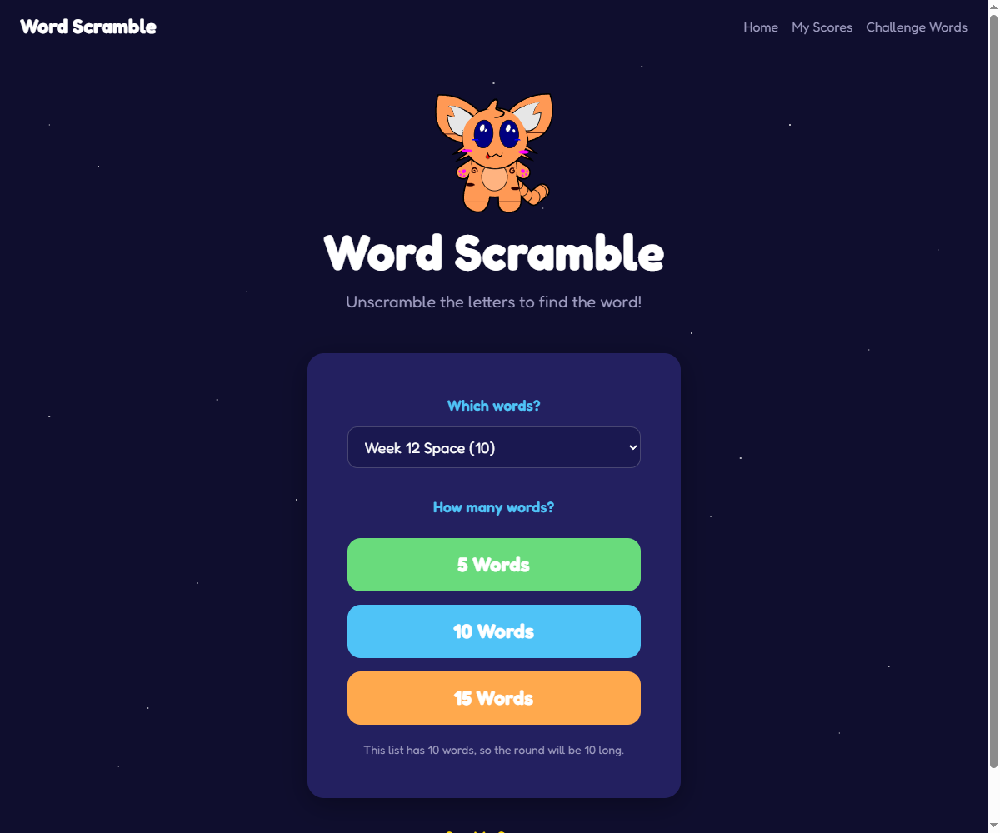
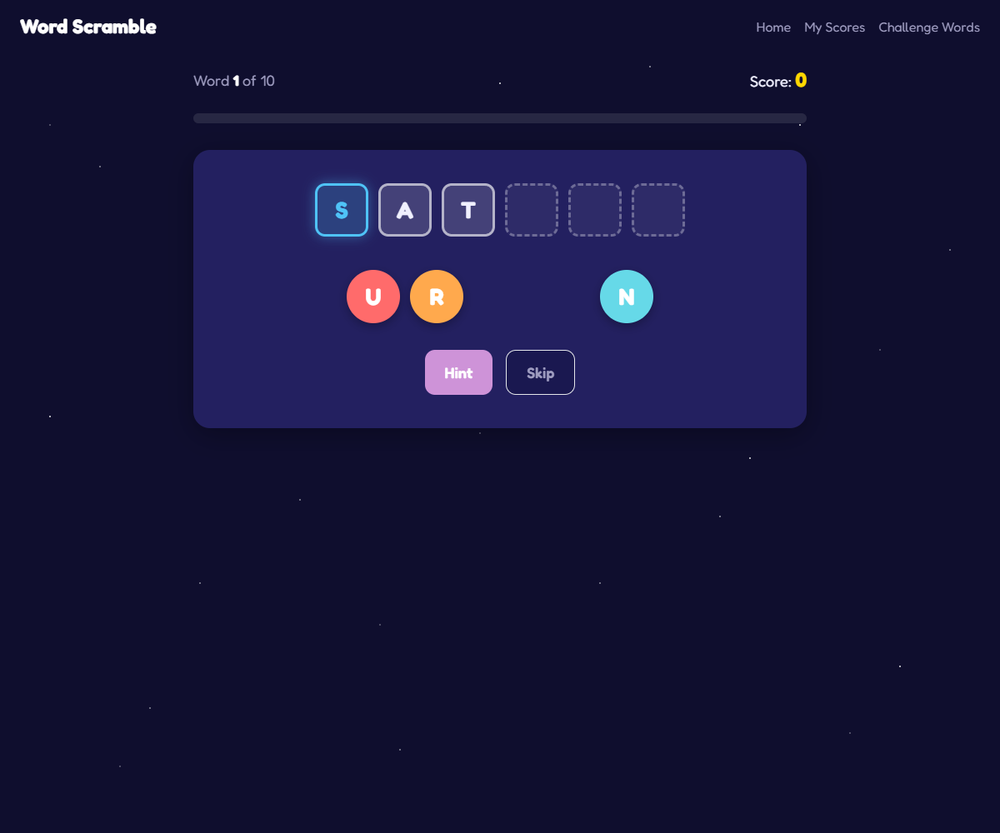
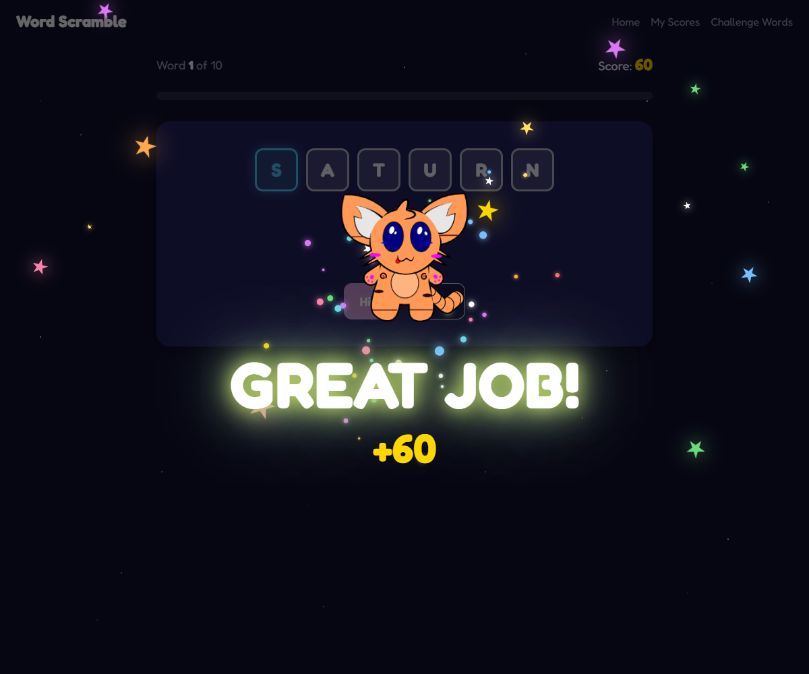
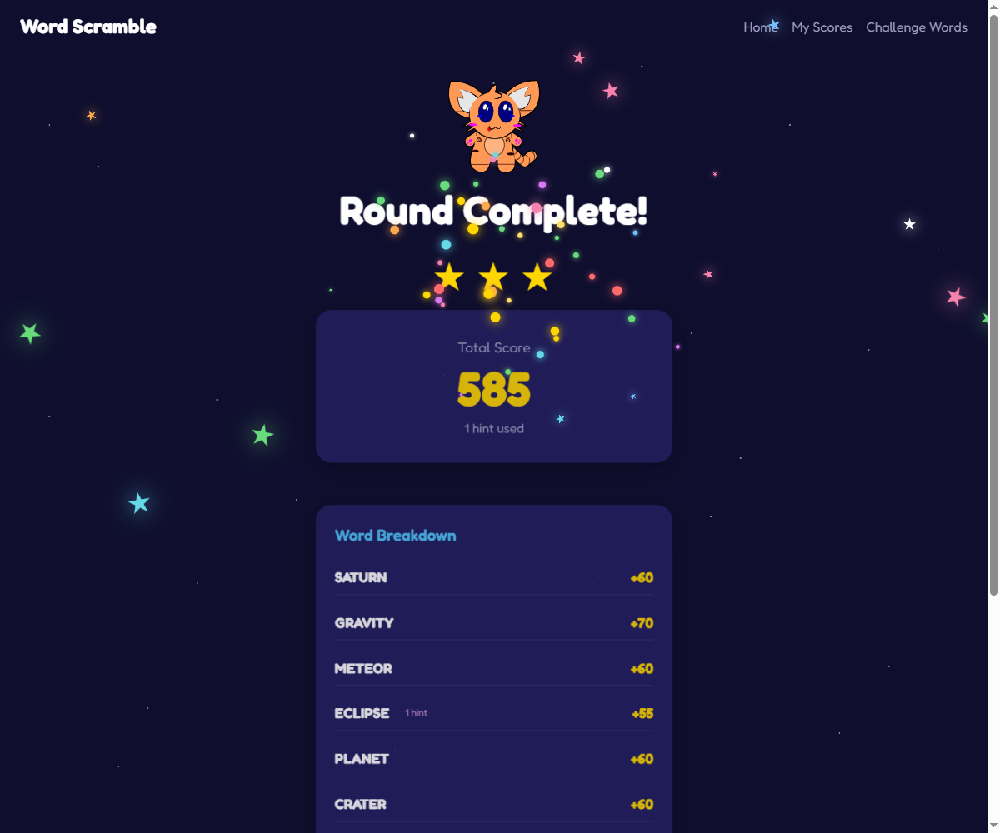
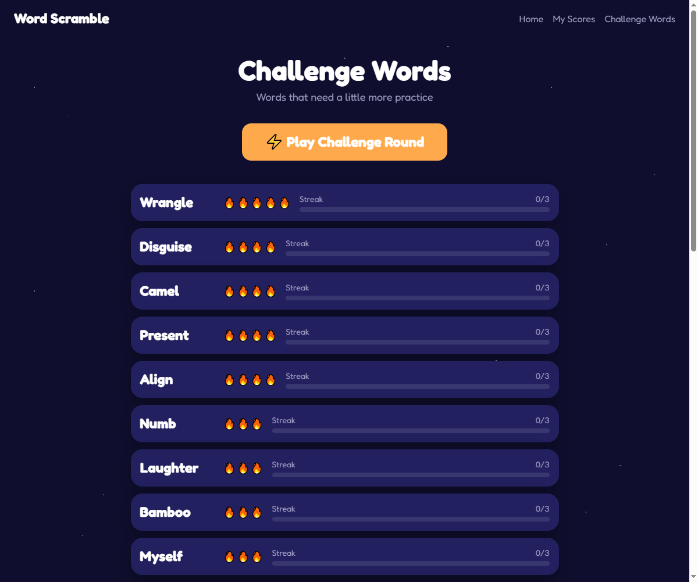
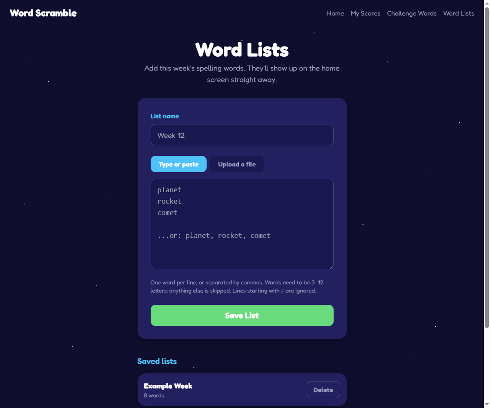
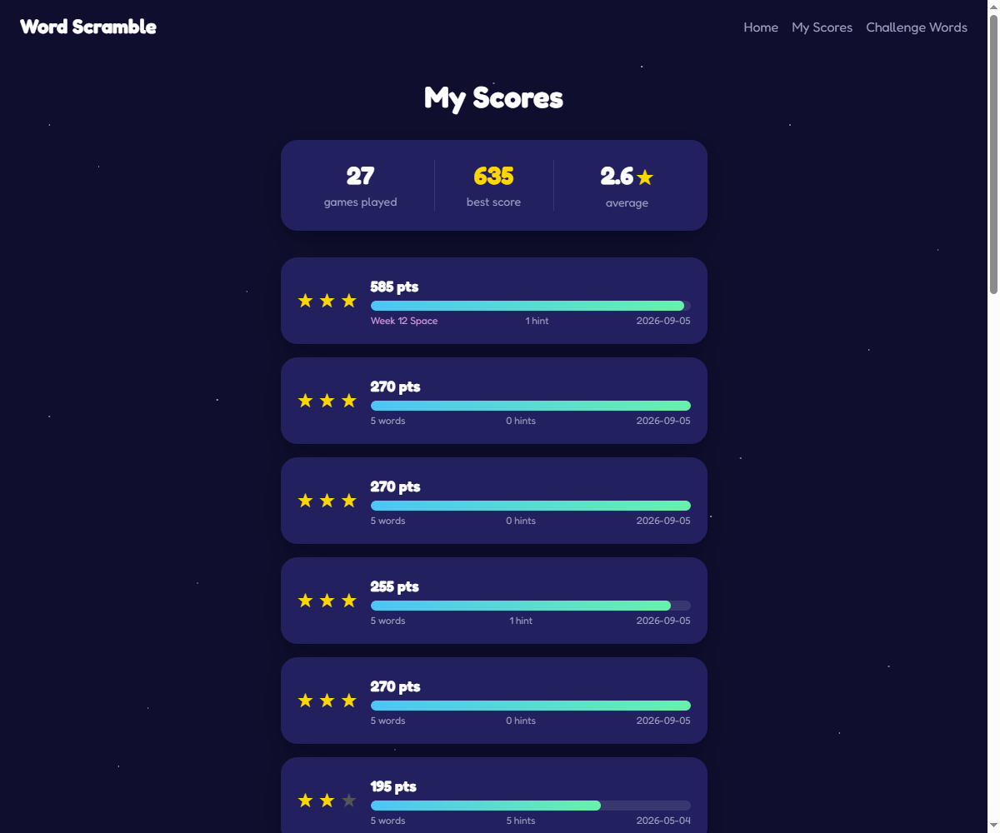

# Word Scramble

A word-scramble spelling game for early readers. Drag the scrambled letter tiles
into place to spell the word, earn stars for the round — and the app quietly
tracks which words keep causing trouble so it can serve them back later.

Built for my daughter to practise her weekly spelling list. The mascot is her
drawing; I vectorised it.



<table>
<tr>
<td width="50%"></td>
<td width="50%"></td>
</tr>
<tr>
<td></td>
<td></td>
</tr>
<tr>
<td></td>
<td></td>
</tr>
</table>

**Python 3.10+ · Flask · SQLite · Alpine.js · Tailwind CSS · pytest**

```bash
./scripts/setup.sh && ./scripts/run.sh     # Windows: .\scripts\setup.ps1
```

Then open <http://localhost:5000>. No build step, no bundler, no Node.

---

## This week's spelling words

Open **Word Lists**, paste the words in or upload the file from school, and
they appear in the home-screen picker straight away. No restart, no shell
access, no naming convention. Words can be one per line or separated by
commas, because a list copied out of an email rarely arrives tidy.

You can also drop a `.txt` file straight into `static/words/lists/` if you
have shell access — the directory is read on every request, so both routes
work the same way.

A list is played on its own terms. Ask for a 15-word round from a 10-word
list and you get a 10-word round, because padding it with unrelated words
would defeat the point of practising that list. Words from a list feed the
same challenge tracking as everything else, so the ones that keep going wrong
resurface later.

## Who's playing?

The first screen is a profile picker, not a login. Pick a name (or add a new
one) and every score, round and challenge word from then on is that profile's
alone — a sibling playing later doesn't see or continue anyone else's round.
There are no passwords here; Cloudflare Access is what decides who reaches the
app at all, and profiles just keep the people it lets in from playing on top
of each other.

A parent gets a separate, read-only **Progress** view that lists every
profile's stats and history. Opening it never signs you in as that profile
and never touches whatever round they currently have open.

## The interesting part

Most spelling apps for kids are drill-and-repeat: the same words in the same
order, regardless of what the child actually finds hard. This one adapts.

**It measures hesitation, not just correctness.** A solve that takes longer than
roughly two seconds per letter counts as a partial miss, and more than four
seconds per letter counts double — a long pause usually means guessing, even
when the final answer is right. Wrong attempts and skips weigh in too. Words
accumulate misses, surface on a **Challenge Words** page, and only graduate off
it after three clean solves.

**It looks for patterns.** When several practice words share an ending (`-ing`,
`-tion`, `-ould`), the app points that out — words a child struggles with tend
to cluster around a spelling rule rather than being independently hard, and
that's the more useful thing to practise.

A Challenge Round then builds a game entirely from the current practice list,
topping up with ordinary words when it's short.

## Features

- **Player profiles** — a "Who's Playing?" picker keeps everyone's scores,
  history and challenge words separate; no passwords, just pick a name
- **A read-only parent dashboard** — see any profile's progress without
  logging in as them or disturbing whatever round they're mid-way through
- **Custom word lists** — paste or upload this week's spelling words from the browser
- Drag-and-drop **or** tap-to-place letter tiles; the first letter is given
- Hints reveal the next correct letter for 15 points
- 1–3 star ratings based on the round's share of a perfect score
- Automatic challenge-word tracking with a dedicated round mode
- History of every completed round
- Rounds resume where you left off if the page is reloaded
- Cloudflare Access gate for hosting somewhere public

## Architecture

```
app.py        create_app() factory; wsgi.py is the production entry point
config.py     Config / TestConfig, every value from an environment variable
routes/       pages.py (HTML), api.py (JSON), lists.py (list management),
              players.py (the profile picker)
game.py       Game rules: start, check, hint, skip, summarise
scoring.py    Points, hint cost, star thresholds
words.py      Built-in word pool: loading, weighted selection, scrambling
wordlists.py  Parent-supplied vocabulary lists, read fresh on every request
database.py   All SQL, behind a connection() context manager
auth.py       Cloudflare Access gate (off by default, for local dev)
players.py    The active profile: session, not authentication
security.py   CSRF tokens for state-changing requests
```

Three decisions shape it:

**The client never sees the answer.** `/api/round/<id>` returns the scrambled
letters, the length and the first letter — never the word. Answers are checked
and scored server-side, so a score can't be forged from the browser console. A
test fails if a field ever leaks into that payload.

**The rules live in exactly one place.** Points, hint costs and star thresholds
are all in `scoring.py`. They used to be scattered, and the summary and history
pages disagreed about the same round as a result; a regression test now asserts
the two agree.

**Routes stay thin.** They validate input and hand off to `game.py`, which has
no idea HTTP exists — so the rules are tested directly, without a request.

### Scoring

| | |
|---|---|
| Base score | word length × 10 |
| Hint | −15 points each, never below 0 |
| Skip | 0 points, counts as 3 misses against the word |
| Stars | ≥80% of the round maximum = 3★, ≥50% = 2★, else 1★ |

### Why SQLite

Deliberate, not a default. The workload is one child at a time and a few hundred
writes a week, which SQLite handles with enormous headroom. In exchange the
whole database is a single file: backup is one command, there's no second
service to run on boot, no connection pool to tune, and no ~200 MB of resident
memory spent on a database server for a single-user game. Postgres would be
operational overhead with nothing to show for it at this scale.

## Tests

```bash
./scripts/test.sh          # Windows: .\scripts\test.ps1
```

138 tests covering the scoring rules, word selection, the hint and skip flows,
challenge-word graduation, custom word lists and their upload path (including
traversal attempts and oversized bodies), history paging, the HTTP layer, CSRF
rejection, the Cloudflare Access gate (expired, forged and wrong-audience
tokens), player-profile isolation (a second profile can't read or resume the
first one's round), and the migration that attributes pre-profile history to
a default profile. Each test runs against its own throwaway SQLite file.

## Documentation

- **[docs/DEVELOPMENT.md](docs/DEVELOPMENT.md)** — setup, running, testing, and how to
  change words, scoring or the schema
- **[docs/DEPLOYMENT.md](docs/DEPLOYMENT.md)** — gunicorn, systemd, Cloudflare
  Access, the tunnel and backups on a DigitalOcean droplet
- **[CLAUDE.md](CLAUDE.md)** — conventions this codebase holds itself to

## Credits

- Character design and original drawings — my daughter
- Vectorisation and code — me
- Word lists — [k5learning.com](https://www.k5learning.com)
- Sound effects — [Pixabay](https://pixabay.com)

## License

The code is [MIT licensed](LICENSE) — use it however you like.

**The artwork is not.** The mascot was drawn by my daughter and all rights to
it are reserved. If you build on this project, please swap in your own
character art.
