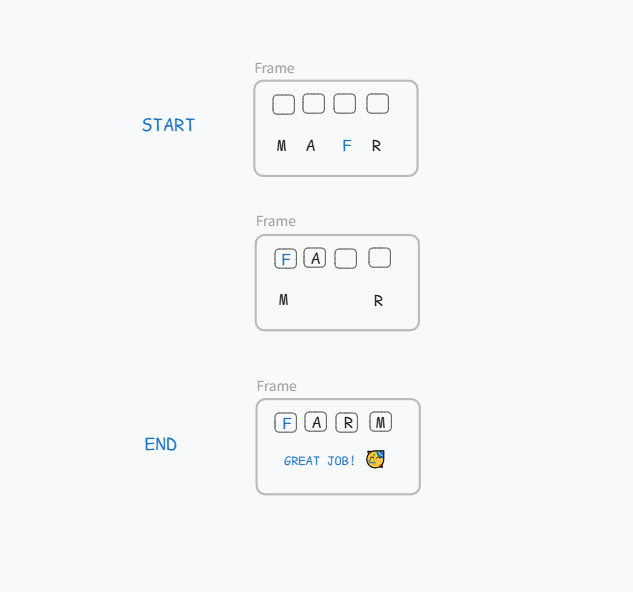

# Word Scramble

A word-scramble spelling game for early readers. Players drag scrambled letter
tiles into place to spell a word, earn stars for a round, and the app quietly
tracks which words they keep getting wrong so it can serve those back later.

Built for my daughter to practise her weekly spelling list. The mascot is her
drawing — I vectorised it, she designed it.



## Why it exists

Spelling apps aimed at kids are mostly drill-and-repeat: the same words in the
same order regardless of what the child actually finds hard. The interesting
part of this project is the **challenge-word tracker**. Every solve is scored
not just right/wrong but on hesitation — an answer that takes more than roughly
four seconds per letter is treated as a partial miss, on the theory that a long
pause means the speller was guessing. Words accumulate misses, surface on a
"Challenge Words" page, and only graduate off it after three clean solves.

The app also spots shared suffixes across the practice list (`-ing`, `-tion`)
and points them out, since words a child struggles with tend to cluster around
a pattern rather than being independently hard.

## Features

- **Drag-and-drop or tap-to-place** letter tiles; the first letter is given
- **Hints** reveal the next correct letter for 15 points
- **Star ratings** — 1–3 stars based on the round's percentage of a perfect score
- **Challenge Words** — automatic tracking of words that need more practice,
  with a dedicated round mode built from them
- **History** of every completed round
- **Resumable rounds** — reloading mid-round picks up where you left off
- **Optional PIN gate** for deployment on a public host

## Tech stack

Python 3.10+ · Flask · SQLite · Jinja2 · Alpine.js · Tailwind CSS

No build step and no bundler. Alpine and Tailwind come from a CDN, so the app
is `git clone` and run.

## Running locally

```bash
python -m venv .venv && source .venv/bin/activate   # Windows: .venv\Scripts\activate
pip install -r requirements.txt
python app.py
```

Open <http://localhost:5000>. The SQLite database is created on first run.

## Tests

```bash
pip install -r requirements-dev.txt
pytest
```

47 tests covering the scoring rules, word selection, the hint and skip flows,
challenge-word graduation, and the HTTP layer including the PIN gate.

## Architecture

```
app.py            Application factory
wsgi.py           Production entry point (gunicorn)
config.py         Environment-driven configuration
routes/
  pages.py        Rendered pages
  api.py          JSON API — request validation only
game.py           Game rules: rounds, answers, hints, skips
scoring.py        Points and star thresholds
words.py          Word list loading, selection, scrambling
database.py       SQLite access; every query lives here
templates/        Jinja2 templates
static/
  js/             game.js, sfx.js, sparkles.js, start-round.js
  css/theme.css   Space theme; all colours are CSS variables
  words/          words_3.txt … words_8.txt, one word per line
  sound/          Sound effects
tests/            pytest suite
```

Three rules shape the layout:

1. **The client never sees the answer.** `/api/round/<id>` returns the scrambled
   letters, the length, and the first letter — never the word. Answers are
   checked server-side and scores are computed server-side, so the score cannot
   be forged from the browser console.
2. **The rules live in one place.** Points, hint costs and star thresholds are
   all in `scoring.py`. Before, the summary page and the history page computed
   stars differently and disagreed about the same round.
3. **Routes stay thin.** They validate input and hand off to `game.py`, which is
   testable without an HTTP request.

### Scoring

| | |
|---|---|
| Base score | word length × 10 |
| Hint cost | −15 points each (never below 0) |
| Skip | 0 points, and counts as 3 misses against the word |
| Stars | ≥80% of the round's maximum = 3★, ≥50% = 2★, else 1★ |

### Sound

Sound effects go through the Web Audio API rather than `<audio>` elements —
replaying an `<audio>` element for a rapid effect like a letter placement has a
noticeable lag, since each play seeks and restarts the element. Buffers are
decoded once on load; an `<audio>` fallback covers the window before decoding
finishes and browsers without Web Audio.

## Deploying

Behind gunicorn and a reverse proxy:

```bash
cp .env.example .env       # set SECRET_KEY, DB_PATH, and ACCESS_PIN
pip install -r requirements.txt
gunicorn --bind 127.0.0.1:8000 --workers 2 wsgi:app
```

Two things matter:

- **Never set `FLASK_DEBUG=1` on a public host.** The Werkzeug debugger is
  remote code execution.
- **Set `ACCESS_PIN`.** The app has no user accounts by design; without a PIN
  anyone who finds the URL can play and see the history.

Point `DB_PATH` at a directory outside the app tree (for example
`/var/lib/wordscramble/`) so a redeploy cannot wipe the scores.

## Credits

- Character design and original drawings — my daughter
- Character vectorisation, code — me
- Word lists — [k5learning.com](https://www.k5learning.com)
- Sound effects — [Pixabay](https://pixabay.com)
